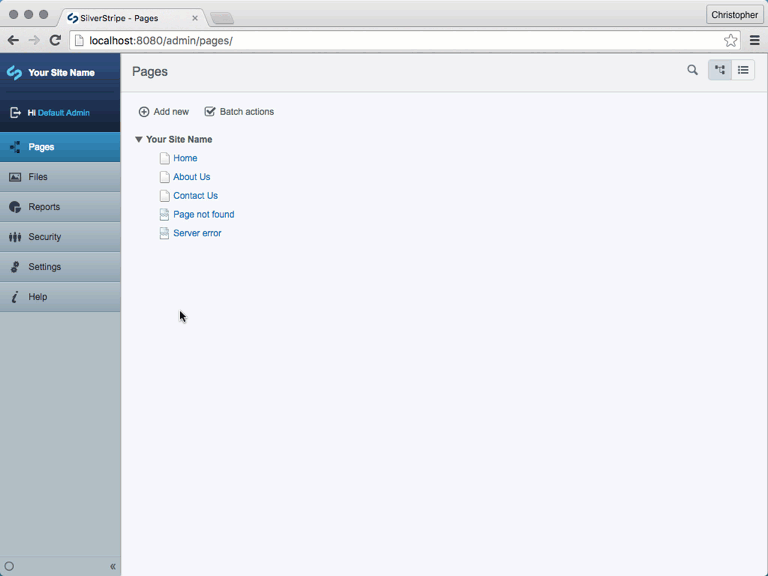

To get started:

```sh
$ git clone git@github.com:assertchris-tutorials/tutorial-silvverstripe-secure-assets.git
$ cd tutorial-silvverstripe-secure-assets
```

Then make an `_ss_environment.php` file, containing at least:

```php
define("SS_ENVIRONMENT_TYPE", "dev");

define("SS_DATABASE_SERVER", "localhost");
define("SS_DATABASE_USERNAME", "<user>");
define("SS_DATABASE_PASSWORD", "<password>");
define("SS_DATABASE_NAME", "<database>");

define("SS_DEFAULT_ADMIN_USERNAME", "admin");
define("SS_DEFAULT_ADMIN_PASSWORD", "password");
```

Then run:

```sh
$ composer install
$ framework/sake dev/build flush=1
$ framework/sake dev/tasks/SilverStripe-Serve-Task
```
